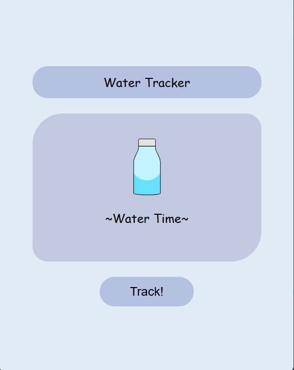

# 💧 Water Tracker

A minimalist desktop application built with **Electron.js** to help you stay hydrated. Designed in Figma and brought to life with HTML, CSS, and JavaScript.

## ✨ Features
* **Minimalist UI:** A clean, distraction-free interface inspired by soft, aesthetic design.
* **Easy Tracking:** One-click tracking to log your water intake.
* **Visual Feedback:** Get a "Great job!" notification every time you hydrate.

## 🛠️ Built With
* [Electron.js](https://www.electronjs.org/) - Desktop framework
* [Node.js](https://nodejs.org/) - JavaScript runtime
* Figma - UI/UX Design

## 🚀 Getting Started

### Prerequisites
Make sure you have [Node.js](https://nodejs.org/) installed on your machine.

### Installation
1. **Clone the repository:**
   ```bash
   git clone [https://github.com/IdaAluso/water-tracker.git](https://github.com/IdaAluso/water-tracker.git)

2. **Navigate into the folder:**
Bash
cd water-tracker

3. **Install dependencies:**
Bash
npm install

4. **To launch the application, run:**
Bash
npm start

# Preview

